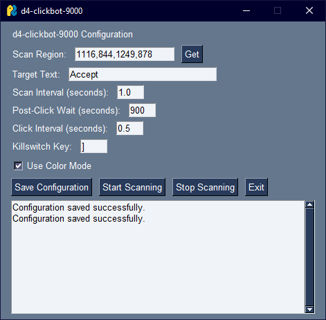
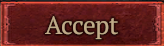

# 🔥 d4-clickbot-9000

Unleash the power of automation in your Diablo 4 adventures! 🖱️⚔️



## 📋 Table of Contents
- [Features](#features)
- [Prerequisites](#prerequisites)
- [Installation](#installation)
- [Usage](#usage)
- [Configuration](#configuration)
- [Troubleshooting](#troubleshooting)

## ✨ Features

- 🔄 Continuously scan for specified text on your screen
- 🖱️ Automatically click when text is found (perfect for those pesky loot drops!)
- ⏱️ Customizable scan intervals and wait times
- 🎨 Optional color mode for better text detection in Sanctuary's varied environments
- 🛑 Easy to stop with GUI button or keyboard shortcut (for when a Unique boss appears!)

## 🛠️ Prerequisites

Before you begin your quest, ensure you have the following equipped:
- Python 3.x (as powerful as any Horadric artifact)
- Tesseract OCR (sharper than Wirt's Leg)

## 📥 Installation

1. Summon this repository or download the script:
   ```
   git clone https://github.com/yourusername/d4-clickbot-9000.git
   ```

2. Enter the portal to the script directory:
   ```
   cd d4-clickbot-9000
   ```

3. Craft the required Python enchantments:
   ```
   pip install PySimpleGUI pytesseract opencv-python numpy Pillow pyautogui keyboard
   ```

4. Install Tesseract OCR:
   - Windows Nephalem: Download and install from [Tesseract at UB Mannheim](https://github.com/UB-Mannheim/tesseract/wiki)
   - macOS Crusaders: `brew install tesseract`
   - Linux Barbarians: `sudo apt-get install tesseract-ocr`

## 🚀 Usage

1. Activate the bot:
   ```
   python d4-clickbot-9000.py
   ```

2. Use the ancient GUI to configure your scan settings (see [Configuration](#configuration) below).

3. Click "Save Configuration" to imbue your settings with power.

4. Click "Start Scanning" to begin your automated adventure.

5. To halt your bot's rampage:
   - Click the "Stop Scanning" button, or
   - Press the 'P' key (for "pause") on your keyboard

6. Click "Exit" or close the window to end your bot's existence.

## ⚙️ Configuration

In the GUI, you can set:

- 🔲 **Scan Region**: Click "Get" to select the area of Sanctuary to scan.

  

- 📝 **Target Text**: Enter the text you want to find (e.g., "Ancient Legendary", "Uber Unique").
- ⏱️ **Scan Interval**: How often to check for the text (in seconds).
- ⏳ **Post-Click Wait**: How long to wait after clicking before resuming scan (in seconds).
- 🖱️ **Click Interval**: Time between clicks when text is detected (in seconds).
- 🎨 **Color Mode**: Enable for color-based text detection (useful for those golden legendaries!).

## 🔧 Troubleshooting

- If text isn't being detected, try:
  - Adjusting the scan region (make sure it covers your inventory or desired area)
  - Enabling/disabling color mode
  - Ensuring the text is clearly visible on screen (no demons obscuring the view)

- If clicks aren't registering, check:
  - Your system's security settings
  - If Diablo 4 has focus (the bot can't click if you're alt-tabbed out)

## ⚠️ Disclaimer

This script is for educational purposes only. Use at your own risk. The creators are not responsible for any consequences of using this script. Always ensure you're complying with Diablo 4's terms of service when using external tools.

## 🤝 Contributing

Contributions, issues, and feature requests are welcome! Feel free to check [issues page](https://github.com/yourusername/d4-clickbot-9000/issues). Together, we can make this bot more powerful than Lilith herself!

## 📜 License

This project is [MIT](https://choosealicense.com/licenses/mit/) licensed. Use it freely, like a Sorcerer's teleport spell!
